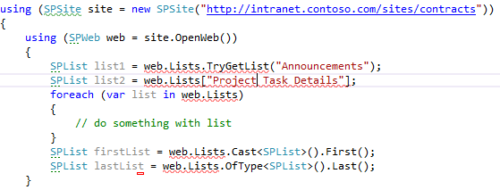

## RESP510209. Inappropriate SPList collection usage.

### Description
List name is culture specific string or could be changed later:
*   Avoid string based index calls to obtain the list.
*   Avoid using TryGetList method for the List access.

Potential performance issues:
*   Avoid all list enumerations via enumerator calls.
*   Avoid all list enumerations via linq Cast<T> expression.
*   Avoid all list enumerations via linq OfType<T> expression.

Inappropriate usage:


### Resolution
Consider retrieving list by its URL with [SPWeb.GetList()](http://msdn.microsoft.com/en-us/library/microsoft.sharepoint.spweb.getlist.aspx) method.
```cs
public void CorrectListUsage(SPWeb web)
{
    var listUrl = "/lists/tasks";
    var taskList = web.GetList(SPUrlUtility.CombineUrl(web.Url, listUrl));
}
```

### Links
[SPWeb.GetList() method](http://msdn.microsoft.com/en-us/library/microsoft.sharepoint.spweb.getlist.aspx)