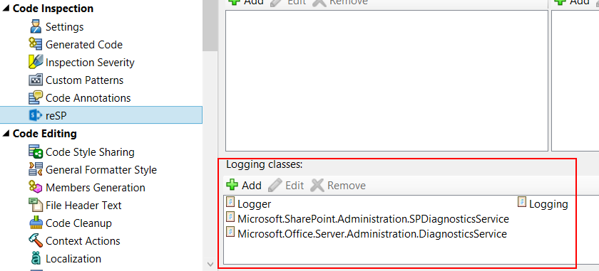

## RESP510241. BackNot logged exception found.

### Description
Catch block should include ULS logging output or re-throw.

### Resolution
Log exception to ULS or re-throw exception.

There will be no issue if you specify logger class name (or pattern) in the reSP option page.

### Links
*   [SPDiagnosticsService Class](https://msdn.microsoft.com/en-us/library/microsoft.sharepoint.administration.spdiagnosticsservice(v=office.14).aspx)