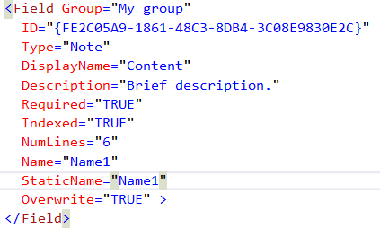
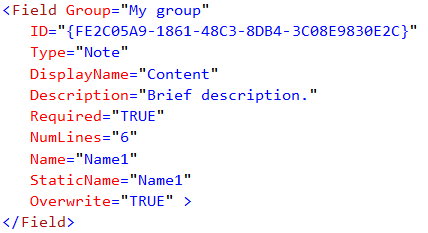

## RESP515112. Incorrect 'Note' field index.

### Description
If you specify (thanks copy & paste) Indexed attribute for note field the follow exception will occuer during feature activation:

Message: _Microsoft.SharePoint.SPException: Cannot complete this action. Please try again.; System.Runtime.InteropServices.COMException: Cannot complete this action. Please try again.; StackTrace: at Microsoft.SharePoint.Administration.SPElementDefinitionCollection.ProvisionListInstances(SPFeaturePropertyCollection props, SPSite site, SPWeb web, Boolean fForce) at Microsoft.SharePoint.Administration.SPElementDefinitionCollection.ProvisionElements(SPFeaturePropertyCollection props, SPWebApplication webapp, SPSite site, SPWeb web, SPFeatureActivateFlags activateFlags, Boolean fForce)_

Maliciously formed XML:

Correctly forment XML, without Indexed attribute:

### Resolution
Remove "Indexed" attribute from Field tag.

### Links
*   [Field Element](http://msdn.microsoft.com/en-us/library/office/aa979575.aspx)