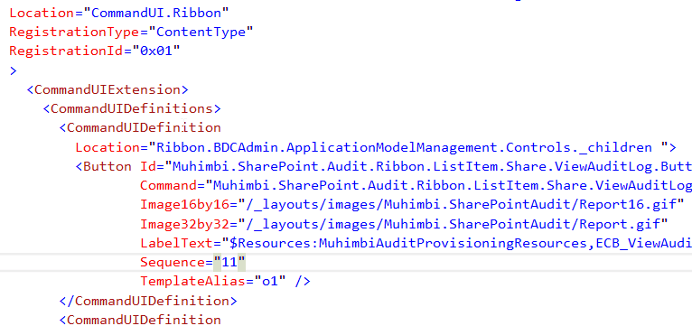

## CommandUIDefinition Location attribute.

### Description
CommandUIDefinition definition has Location attribute. It should contain one of the predefined string constant.
reSP allows you to select value from the drop-down list.
Just use Ctrl+Space shortcut.

### Links
[Default Server Ribbon Customization Locations](https://msdn.microsoft.com/en-us/library/office/ee537543.aspx)