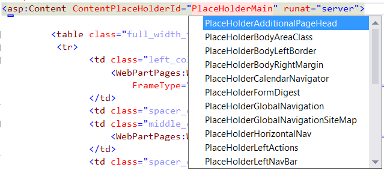

## ContentPlaceHolderId attribute

### Description
Aspx pages can use Content control to split their content into place holders. Each Content control should define ContentPlaceHolderId attribute.
reSP allows you to change ContentPlaceHolderId attribute value from the drop-down list.
Just use Ctrl+Space shortcut.

