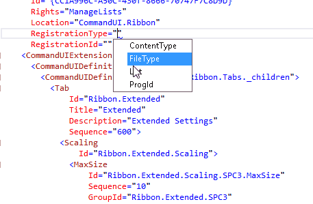

## RegistrationId attribute.

### Description
CustomAction definition has RegistrationId attribute. It's value depends on RegistrationType value.
reSP knows about that relation and allows you to select value from the drop-down list.
Just use Ctrl+Space shortcut.

