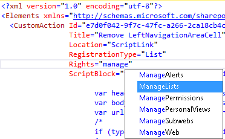

## Rights attribute.

### Description
CustomAction definition has Rights attribute. It should contain one of the predefined string constant.
reSP allows you to select value from the drop-down list.
Just use Ctrl+Space shortcut.

