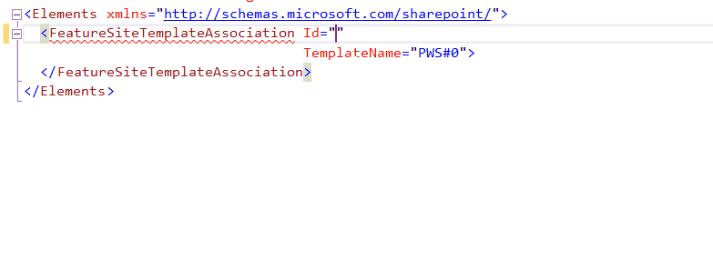

## FeatureSiteTemplateAssociation Id attribute

### Description
Feature stapling is an approach used to associate custom features with a site definition. This feature will be activated automatically when a new site is created from the associated site definition. The Id attribute contains Ids of "Staplee" feature.
"Staplee" – the feature associated with a site definition or the feature that applies the customization.
reSP allows you to select from the drop-down list.
Just use Ctrl+Space shortcut.

