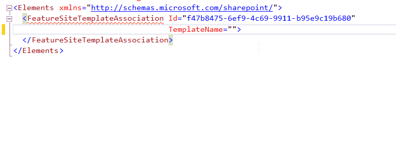

## FeatureSiteTemplateAssociation TemplateName attribute.

### Description
Feature stapling is an approach used to associate custom features with a site definition. This feature will be activated automatically when a new site is created from the associated site definition. The TemplateName attribute contains names of site definition configuration.

reSP allows you to select from the drop-down list.
Just use Ctrl+Space shortcut.

