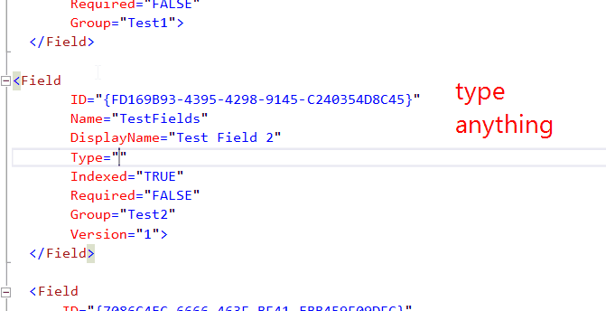

## Field Type attribute.

### Description
Field definition has Type attribute. It should contain one of the predefined types.
reSP allows you to change type name from the drop-down list.
Just use Ctrl+Space shortcut.

