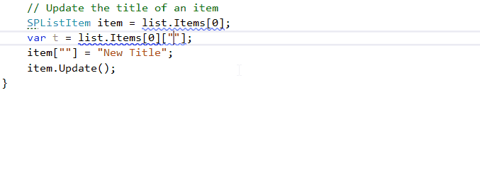

## Use SPBuiltInField.

### Description
Use solution defined fields in conjunction with predefined contants from SPBuiltInFieldId class as field name while working with SPListItem object.
reSP allows you to change it from the drop-down list.
Just create literal quotes and press Ctrl+Space shortcut.

