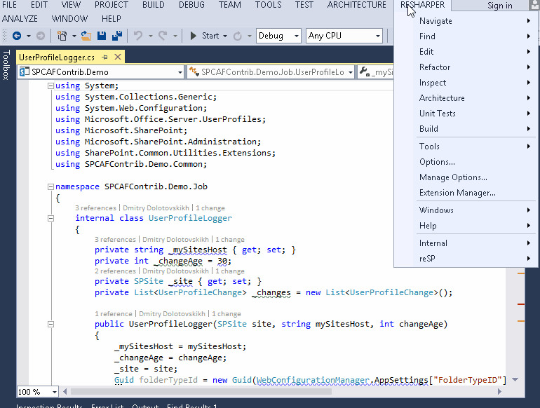
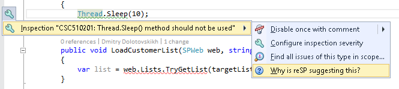

## F.A.Q.
### How is it possible to check all solution projects?
In case of "bulk" analyse R# exposes the list of incidents in the separate windows.

### How to change rule severity in the ReSharper?
1 approach:
Open ReSharper | Option dialog and select Code Inspection | Inspection Severity
Click on the reSP title
Click on the colored box with current severity level.

2 approach:
Depends on issue severity the problem text is highlighted in different ways and corresponded color marks are added to the marker bar. Mostly each of highlightings has a quick fix action (look like a bulb). And you can apply this fix on the current file, current folder or project or whole solution.

### How can I read more about highlighting?
Open context menu, select [Inspection "name of issue"] and select "Why is reSP suggestion this?". The help page will be opened immediatelly in the browser.

You need to ensure that [CheckId - help page url] pair exists in the project resources.

You can read more about ReSharper code inspection [here](https://www.jetbrains.com/resharper/help/Code_Analysis__Index.html).

### How can I do something more with ReSharper?
Read [this](http://sadomovalex.blogspot.ru/search/label/ReSharper) article to know about live templates.

### Where I can find the quick access key map in for ReSharper?
Check out this [guide](../assets/ReSharper_DefaultKeymap_VSscheme.pdf) PDF.

### How can I enable/disable ReSharper code analysis for specific files?
- Ctrl-8 for the current file, for the current session.
- Ctrl-Alt-8 for disabling Resharper code analysis.

### List of excluded libraries
You can configure lists of ignored files using regular expression or wildcards in the ReSharper | Options dialog.
