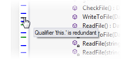

## Known issues
1.XML files are not processed as part of Solution Wide Error Analysis, so any custom problem analysers for will not show up in SWEA. You need to open its in the Visual Studio editor and check marker bar.

2.Extra features are not initialized in the current R# environment. Because there are some problems with zone activation I think.
