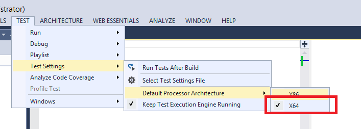
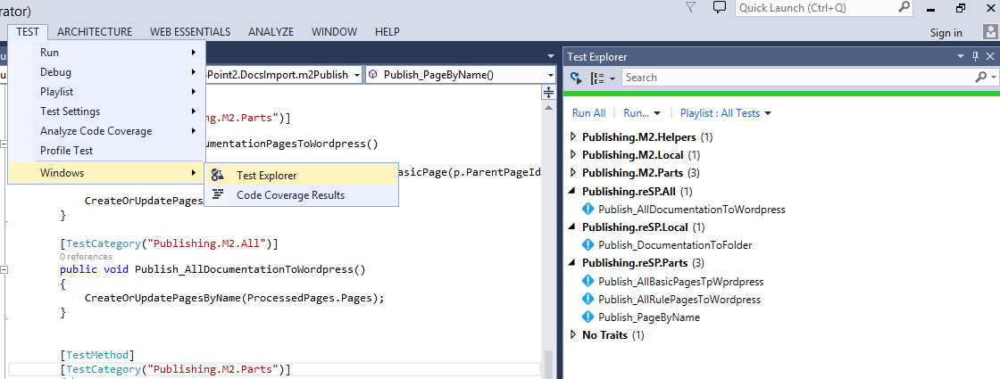

* Check if you have x64 test run setup correctly

* Compile the project, go to "Test-> Windows -> Test Explorer"

* Configure 'VSProjectPath = @"C:\_dvd73\Source\ReSharePoint.Docs";' in reSPPublishing.cs

* Check 'reSPPublishing.cs', run a test which you need :)